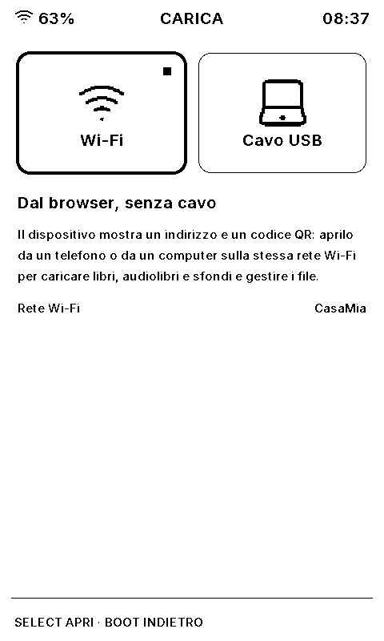

# Rustmix Wave user guide

This guide describes the firmware on the `feature/merge-eink` branch, published as `beta` (version 1.5.0-beta.4): Rustmix Wave v1.4.8 merged with the E-ink firmware, on the Waveshare ESP32-S3 3.97-inch e-paper board. The interface speaks Italian by default (Settings → Lingua switches to English); screen labels below are given in Italian with the English wording in parentheses.

Images named `rendered-*.png` are drawn by the firmware's own renderer and match the panel pixel for pixel; the `*.jpg` photographs predate the merge. See [`screenshots/README.md`](../screenshots/README.md).

## Physical controls

| Control | Behavior |
| --- | --- |
| Rocker up / down | Move the selection, change a value, turn a page, or change the volume in the audiobook player |
| Rocker press (SELECT) | Open the selected item or run the selected action |
| Hold SELECT | Contextual menu: book actions in the Library, the options of a Reader page, the audiobook player menu |
| BOOT | Back |
| Power, short press | Standby: the sleep screen is drawn, then the PMIC powers the board off. Press Power again to turn it back on where you left off |
| Power, long press | Display maintenance menu: **Clear ghosting now** runs a full refresh |

The footer of each screen repeats the controls that apply there.

The panel's controller sleeps after a minute without input; the next key press wakes it without a flash. After the idle time set in Settings → Schermo (10 minutes by default) the board goes into standby by itself, except while an audiobook is playing or the microSD is connected to a PC.

## First start

On a microSD that was never used the device makes its folders (`RUSTMIX/BOOKS`, `AUDIO`, `SLEEP`) and opens on a few pages instead of Home. First the language, written in both: **English** is under the cursor, Down moves to **Italiano**, SELECT chooses. Then five numbered pages:

| Page | What it is for | Rows |
| --- | --- | --- |
| 1. I tasti (The keys) | What the rocker, BOOT and Power do | Avanti (Next) · Salta la configurazione (Skip the setup) |
| 2. Wi-Fi | Opens the phone portal to add a network | Configura dal telefono (Set up from a phone) · Salta (Skip) |
| 3. Data e ora (Date and time) | Shows date, time and time zone | Vanno bene (They are right) · Cambia (Change) |
| 4. Primo libro (First book) | The two ways of copying books | Dal telefono, via Wi-Fi · Dal computer, con il cavo USB · Più tardi (Later) |
| 5. Pronto (Ready) | Where to find these pages again | Vai alla Home (Go to Home) |

No page is mandatory: the last row of each moves on, and BOOT goes back one page. The portal, the date editor and Connect to PC opened from a page come back to it. Choosing the language also puts a short guide among the books (`Guida rapida` or `Quick guide`), to try reading at once.

The pages show once per card. If the device is switched off halfway, they pick up from the same page. Afterwards they are in Settings → **Primi passi** (First steps).

With no card, or one that cannot be read, the device opens on a warning instead: **Riavvia** (Restart) tries again, **Continua senza** (Go on without it) goes to Home. A new card of 64 GB or more must first be formatted as FAT32 on a computer; the device does not format cards.

## 1. Home

The **Continua** (Continue reading) card at the top shows the book being read: its cover, title, time left at your reading speed and progress. SELECT on it reopens the book at the saved page. With no book on the card it reads **Aggiungi il primo libro** (Add your first book) and SELECT opens Carica. Below it, today's reading time and the current streak.

| Tile | Opens |
| --- | --- |
| Libreria (Library) | Your books |
| Audiolibri (Audiobooks) | Your audiobooks |
| Stats (Statistics) | Reading statistics |
| Carica (Upload) | Copy files onto the card: over Wi-Fi from a browser, or with the USB cable |
| File (Files) | microSD browser |
| Opzioni (Settings) | Device settings |

## 2. Library

Books from `RUSTMIX/BOOKS` on the microSD (TXT and EPUB), as a grid of covers: first **In lettura** (Reading now), then **Recenti** (the rest). Under each cover, a progress bar with the percentage, **Nuovo** for a book never opened, or a completed mark. A book without a usable cover shows its title on the placeholder instead.

Covers are prepared once per book, the first time it appears on screen, and kept in `RUSTMIX/READER/CACHE`. Books uploaded from the Wi-Fi portal get their cover from the browser straight away.

SELECT opens the selected book; in an empty Library it opens Carica instead. Hold SELECT for its actions:

- **Segna come completato** (Mark as Completed)
- **Segna come non letto** (Mark as Unread): forgets where the book was left; its bookmarks stay.
- **Segnalibri** (Bookmarks): the bookmarks saved in that book, to open one directly. Hold SELECT on one to delete it.
- **Elimina libro** (Delete Book): removes the file from the card, with its position and bookmarks. The row asks to confirm: a second SELECT deletes, BOOT or moving away cancels.

Under the title, the screen shows the format, the size and how much of the book was read.

## 3. Reader

Up and Down turn the page. An EPUB opens on its cover, when it has one; Down goes on to the text. The bar at the top shows the progress through the book.

- **Dizionario** (Dictionary): press SELECT on a page to choose a line, then a word, and look it up in the dictionary pack installed under `RUSTMIX/APPS/DICT` (see [`SD_CARD_SETUP.md`](SD_CARD_SETUP.md)). The line only picks where to start: past its last word the selection goes on to the next line, and before its first word back to the line above.
- **Opzioni** (Options): hold SELECT for the table of contents, the book's bookmarks, add or remove a bookmark on this page, **Vai a** (Go to) and the reading preferences.

The table of contents opens on the chapter being read, marked **qui** (here). The bookmark list shows the open book's bookmarks, with the chapter and page and how far into the book each is: SELECT opens one, hold SELECT deletes it. A page that has a bookmark carries a small ribbon in its top right corner. **Vai a** jumps to a point of the book given as a percentage: Up and Down move it by 5% (0% is the first page, 100% the last), an EPUB shows the chapter that point falls in, and SELECT goes there.

| Preference | Values |
| --- | --- |
| Theme | Normal, High contrast (white on black) |
| Orientation | Portrait, Landscape |
| Font size | Four sizes |
| Font | Literata, Atkinson Hyperlegible (for low vision) |
| Alignment | Left, Justified, Center, Right |
| Full screen | Hide the progress bar and footer |

Every page turn saves the position; each book reopens where you left it, and **Continua** on Home reopens the last one. Photographs of the table of contents and bookmarks (before the merge): [`reader-toc.jpg`](../screenshots/reader-toc.jpg), [`reader-bookmarks.jpg`](../screenshots/reader-bookmarks.jpg), [`reader-bookmarks-list.jpg`](../screenshots/reader-bookmarks-list.jpg).

## 4. Audiobooks

Audiobooks from `RUSTMIX/AUDIO`: a single MP3 file is one audiobook, and a folder of MP3 files is one audiobook whose tracks play in name order, numbers counted as numbers ("2" before "10"). The list shows each title with its progress; SELECT plays the selected one from where it was left.

| Control | Player |
| --- | --- |
| SELECT | Play / pause |
| Up / Down | Volume |
| Hold SELECT | Menu: back 30 s, forward 30 s, previous track, next track, the track list, the sleep timer, stop |
| BOOT | Back to the list; playback goes on |

**Tracce** (Tracks) lists the tracks of the title, the one playing marked: SELECT starts a track from its beginning. **Timer di spegnimento** (Sleep timer) stops playback by itself: each SELECT moves it to 15, 30, 45, 60 minutes or off, and the player shows the minutes left. BOOT goes back one level, from the track list to the menu and from the menu to the player.

The position of every audiobook is saved in `RUSTMIX/AUDIOPOS.TXT`, and the volume, also set from Settings → Audio, in `RUSTMIX/VOLUME.TXT`: both survive standby and restarts. Sound comes from the speaker header on the board. MP3 files (MPEG-1 or 2, layer III) play at their own sample rate, mono or stereo.

## 5. Statistics

Reading time today, this week and this month, the streak of consecutive days, the reading speed and the last seven days, and the books read most this month. Days follow the time zone set in Settings → Orologio. The time left shown on Home and in the Reader comes from the same reading speed.

## 6. Upload

**Carica** offers the two ways of copying files onto the card, side by side; under them the screen says what the selected one does. UP and DOWN move between them, SELECT opens it, BOOT goes back.

- **Wi-Fi**: from a browser, without a cable. Described below.
- **Cavo USB** (USB cable): the microSD as a USB disk on a computer, the quickest way for many or large files. See section 9.

With a Wi-Fi network configured, the screen shows the address to open in a browser on the same network (or a QR code that opens it). The page asks for no code: it is reachable by anyone on that network while the Upload screen is open, and closes when you leave it or after ten minutes in which nobody uses it. It speaks the device's language. The header says whether the device still answers and how much space is free. Configuration files (`WIFI.TXT`, `CLOCK.TXT`, `DISPLAY.TXT`) are protected.

| Tab | What it does |
| --- | --- |
| Libri (Books) | Upload EPUB and TXT books, with their covers; search, download, delete |
| Audiolibri (Audiobooks) | Upload MP3 files: one file is one audiobook, several chosen together are asked for a title and become its tracks |
| Sfondi (Wallpapers) | Make a sleep image from any picture |
| File (Files) | The whole card as a file explorer |
| Wi-Fi | Saved networks, and nearby ones when on the device's hotspot |

**Files.** A tap opens a folder, or previews a text or a picture; the three dots open a row's actions: download, rename, move to another folder, delete. A long press starts a selection, with a bar to download, move or delete several things at once. On a computer: click to select, double click to open, right click for the menu, F2 to rename, Del to delete, and drag a row onto a folder to move it or files from the computer to upload them. Deleting shows **Annulla** (Undo) for six seconds. The device's own files and folders are hidden until you ask to see them. A file over 64 MB is refused before it is sent: use the USB cable for those.

**Wallpapers.** Search for a picture (the results are free pictures from Wikimedia Commons), choose one from the phone or computer, or paste one copied elsewhere. Then drag it and zoom (two fingers, the mouse wheel or the slider) inside the upright frame, which is the screen as you hold the device. **Come si vedrà** shows the black and white result; **Salva sfondo** stores it in `RUSTMIX/SLEEP`. The page turns the image for the panel, sets the contrast and names the file by itself. Searching needs the Internet, so it is not offered on the device's own hotspot.

Without a Wi-Fi network, the device opens its own hotspot and shows a QR code: join it with a phone, and the setup page opens by itself, to add networks (up to 8) and passwords with the phone's keyboard.

## 7. Files

A browser of the whole microSD, with a preview of text files. SELECT opens a folder or previews a file; BOOT closes the preview or goes up one folder, and from the top folder back to Home. Hold SELECT on a file to delete it: the row asks **eliminare?** and a second SELECT deletes, while BOOT or the rocker cancel. Folders cannot be deleted from here.

## 8. Settings

| Tile | Contents |
| --- | --- |
| Rete (Network) | Connection state, saved networks, Wi-Fi setup |
| Aggiorna (Update) | Firmware updates over Wi-Fi, from the stable or the beta channel (never checked automatically) |
| Audio | Codec state, volume, test chime |
| Orologio (Clock) | Date, time and time zone (Europe/Rome by default, New York, UTC). The editor goes through time zone, day, month, year, hour and minute; BOOT steps back one field |
| Schermo (Display) | Interface text size, sleep screen, automatic standby |
| Lingua (Language) | Italiano, English |
| Info | Firmware version, board and memory state; **Ripristina impostazioni** (Restore settings) |
| Primi passi (First steps) | The first-start pages, to go through again |

The sleep screen is what stays on the glass during standby: the images in `RUSTMIX/SLEEP` in turn (default) or at random, or the cover of the book being read. Automatic standby comes after 5, 10 (default), 15, 30 or 60 minutes without input, or never.

Rete lists the connection state and four actions. **Configura da telefono** opens the portal of section 6. **Reti salvate** lists the saved networks, the connected one marked: SELECT on a network opens a menu to connect to it or forget it. If it cannot be joined, the Network screen says so and the device goes back to the saved networks by itself. **Riprova connessione** tries the saved networks again, and **Dettagli** shows the time synchronization and the last error.

Update shows the installed version and the channel. **Stabile** follows the latest stable release; **Beta** the highest version among the recent releases, pre-releases included, so a newer stable release reaches it too. UP and DOWN move between the action and the channel: SELECT on the channel switches it and checks; SELECT on the action checks again, or installs the update found, after a second SELECT to confirm. This firmware is a beta (`1.5.0-beta.4`): it follows Beta until the channel is changed, and the choice is kept in `RUSTMIX/UPDATE.TXT`. Back on Stable the device never installs an older firmware: it waits for a stable release newer than the one it runs.

While an update downloads, the screen shows a bar with the percentage and the megabytes received, redrawn every 10%.

**Ripristina impostazioni**, on Info, puts the interface text size, the automatic standby, the sleep screen, the "most used" settings and the update channel back to their first values, after a second SELECT to confirm. The language, the clock, the Wi-Fi networks, the books and the reading preferences are not touched.

Update also shows the bootloader the device has (ESP-IDF version and build date). When the firmware is up to date and the release carries a different bootloader, the screen offers it: SELECT downloads and checks it, writing nothing; a second SELECT writes it, then the device restarts. The write needs the battery at 50% or the USB cable, and takes under a second: do not switch the device off meanwhile, because a bootloader cut halfway can only be fixed by reflashing over USB.

## 9. Connect to PC

Reached from Home → Carica → Cavo USB. Connect the board to a computer with the USB cable and press SELECT: the microSD appears on the computer as a USB disk, to copy books into `RUSTMIX/BOOKS` and audiobooks into `RUSTMIX/AUDIO`. Meanwhile the device is not usable, and the serial port is gone.

When done, eject the disk on the computer, then press a key on the device (not BOOT): it restarts and finds the new files. The firmware never formats the card, not even when the computer is unplugged without ejecting.

## 10. Standby and power

- **Power, short press**: standby. The sleep screen is drawn and the board powers off; Power turns it back on where you left off.
- **Automatic standby**: see Settings → Schermo.
- **Power, long press**: a menu to clear ghosting with a full refresh (the display also runs one by itself every 50 partial refreshes) and to restart the device (**Riavvia**), which saves the reading and listening positions first. There is no separate "power off": standby already cuts the power.
- Holding Power for about 6 seconds cuts the power in hardware, like on any device with a PMIC.

## 11. Screenshot index

| Image | Screen |
| --- | --- |
| [rendered-home.png](../screenshots/rendered-home.png) | Home |
| [rendered-library.png](../screenshots/rendered-library.png) | Library |
| [rendered-book-actions.png](../screenshots/rendered-book-actions.png) | Book actions |
| [rendered-reader-page.png](../screenshots/rendered-reader-page.png) | Reader page |
| [rendered-reader-preferences.png](../screenshots/rendered-reader-preferences.png) | Reading preferences |
| [rendered-audiobooks.png](../screenshots/rendered-audiobooks.png) | Audiobooks |
| [rendered-audiobook-player.png](../screenshots/rendered-audiobook-player.png) | Audiobook player |
| [rendered-audiobook-player-menu.png](../screenshots/rendered-audiobook-player-menu.png) | Player menu |
| [rendered-statistics.png](../screenshots/rendered-statistics.png) | Statistics |
| [rendered-upload.png](../screenshots/rendered-upload.png) | Upload: Wi-Fi or USB cable |
| [rendered-wifi-transfer.png](../screenshots/rendered-wifi-transfer.png) | Wi-Fi transfer |
| [rendered-files.png](../screenshots/rendered-files.png) | Files |
| [rendered-settings.png](../screenshots/rendered-settings.png) | Settings |
| [rendered-usb-disk.png](../screenshots/rendered-usb-disk.png) | Connect to PC |
| [rendered-usb-disk-active.png](../screenshots/rendered-usb-disk-active.png) | Connected to PC |
| [continue-reading1.jpg](../screenshots/continue-reading1.jpg) | Continue Reading (photo) |
| [opening_book.jpg](../screenshots/opening_book.jpg) | Opening a book (photo) |
| [epub-reader.jpg](../screenshots/epub-reader.jpg) | EPUB page (photo) |
| [epub-reader-options.jpg](../screenshots/epub-reader-options.jpg) | EPUB page options (photo) |
| [txt-reader.jpg](../screenshots/txt-reader.jpg) | TXT page (photo) |
| [txt-reader-options.jpg](../screenshots/txt-reader-options.jpg) | TXT page options (photo) |
| [reader-toc.jpg](../screenshots/reader-toc.jpg) | Table of contents (photo) |
| [reader-bookmarks.jpg](../screenshots/reader-bookmarks.jpg) | Bookmark added (photo) |
| [reader-bookmarks-list.jpg](../screenshots/reader-bookmarks-list.jpg) | Bookmarks (photo) |
| [reader-reading-prefs.jpg](../screenshots/reader-reading-prefs.jpg) | Reading preferences (photo) |
| [files-listing.jpg](../screenshots/files-listing.jpg) | Files (photo) |
| [directory-listing.jpg](../screenshots/directory-listing.jpg) | Folder in Files (photo) |
| [wifi-transfer.jpg](../screenshots/wifi-transfer.jpg) | Wi-Fi transfer (photo) |
| [network.jpg](../screenshots/network.jpg) | Network (photo) |
| [network-details.jpg](../screenshots/network-details.jpg) | Network details (photo) |
| [audio.jpg](../screenshots/audio.jpg) | Audio (photo) |
| [audio-details.jpg](../screenshots/audio-details.jpg) | Audio details (photo) |
| [clock.jpg](../screenshots/clock.jpg) | Clock (photo) |
| [rtc-details.jpg](../screenshots/rtc-details.jpg) | RTC details (photo) |
| [device-info.jpg](../screenshots/device-info.jpg) | Device info (photo) |
| [device-info1.jpg](../screenshots/device-info1.jpg) | Board info (photo) |
| [device-info2.jpg](../screenshots/device-info2.jpg) | Runtime info (photo) |
| [sleep.jpg](../screenshots/sleep.jpg) | Sleep screen (photo) |
