# Rustmix Wave user guide

This guide describes the firmware on the `feature/merge-eink` branch: Rustmix Wave v1.4.8 merged with the E-ink firmware, on the Waveshare ESP32-S3 3.97-inch e-paper board. The interface speaks Italian by default (Settings → Lingua switches to English); screen labels below are given in Italian with the English wording in parentheses.

Images named `rendered-*.png` are drawn by the firmware's own renderer and match the panel pixel for pixel; the `*.jpg` photographs predate the merge. See [`screenshots/README.md`](../screenshots/README.md).

## Physical controls

| Control | Behavior |
| --- | --- |
| Rocker up / down | Move the selection, change a value, turn a page, or change the volume in the audiobook player |
| Rocker press (SELECT) | Open the selected item or run the selected action |
| Hold SELECT | Contextual menu: book actions in the Library, the options of a Reader page, the audiobook player menu |
| BOOT | Back |
| Power, short press | Standby: the sleep screen is drawn, then the PMIC powers the board off. Press Power again to turn it back on where you left off |
| Power, long press | Display maintenance menu: **Clear ghosting now** runs a full refresh |

The footer of each screen repeats the controls that apply there.

The panel's controller sleeps after a minute without input; the next key press wakes it without a flash. After the idle time set in Settings → Schermo (10 minutes by default) the board goes into standby by itself, except while an audiobook is playing or the microSD is connected to a PC.

## 1. Home

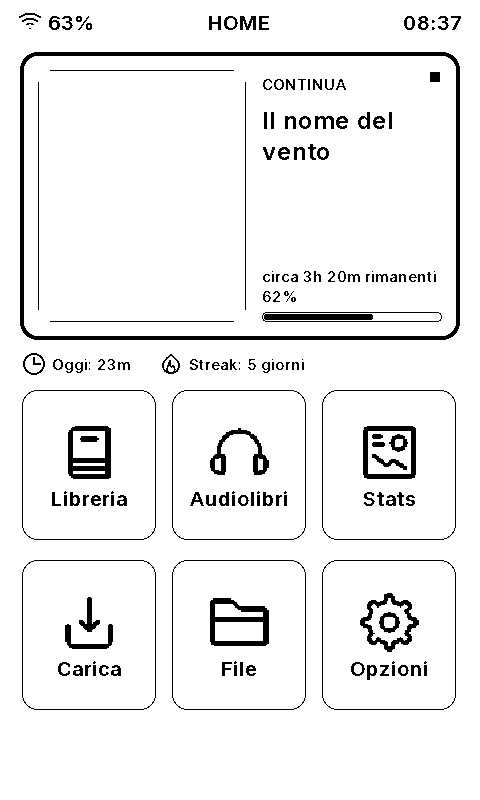

The **Continua** (Continue reading) card at the top shows the book being read: its cover, title, time left at your reading speed and progress. SELECT on it reopens the book at the saved page. Below it, today's reading time and the current streak.

| Tile | Opens |
| --- | --- |
| Libreria (Library) | Your books |
| Audiolibri (Audiobooks) | Your audiobooks |
| Stats (Statistics) | Reading statistics |
| Carica (Upload) | Wi-Fi transfer from a browser, or Wi-Fi setup from a phone |
| File (Files) | Read-only microSD browser |
| Opzioni (Settings) | Device settings |

## 2. Library

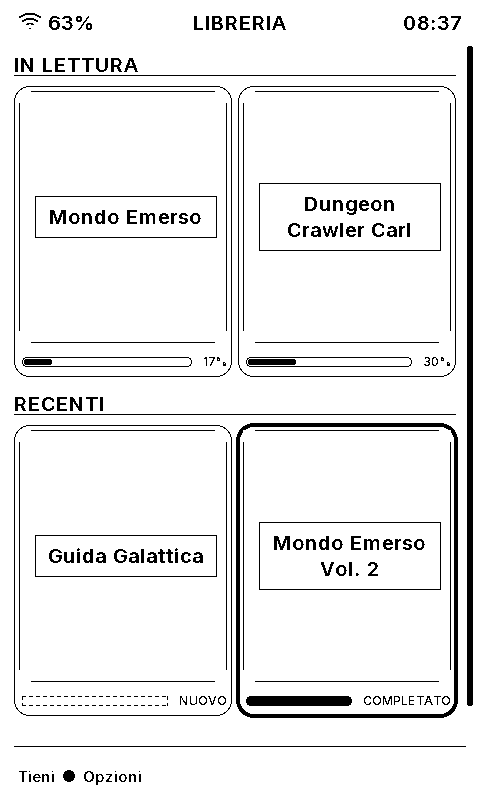

Books from `RUSTMIX/BOOKS` on the microSD (TXT and EPUB), as a grid of covers: first **In lettura** (Reading now), then **Recenti** (the rest). Under each cover, a progress bar with the percentage, **Nuovo** for a book never opened, or a completed mark. A book without a usable cover shows its title on the placeholder instead.

Covers are prepared once per book, the first time it appears on screen, and kept in `RUSTMIX/READER/CACHE`. Books uploaded from the Wi-Fi portal get their cover from the browser straight away.

SELECT opens the selected book. Hold SELECT for its actions:

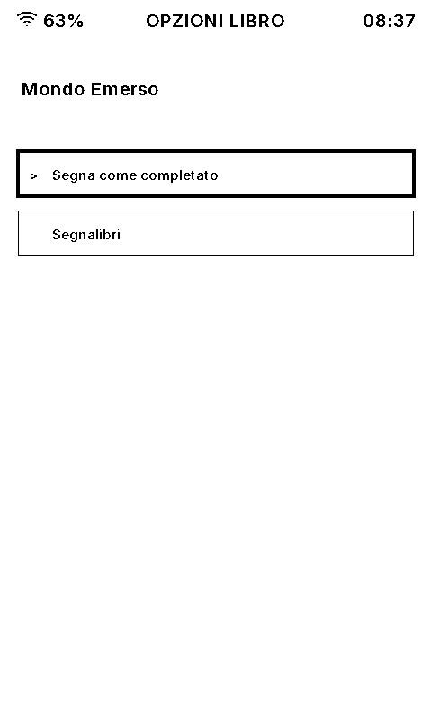

- **Mark as Completed**
- **Bookmarks**: the bookmarks saved in that book, to open one directly.

## 3. Reader

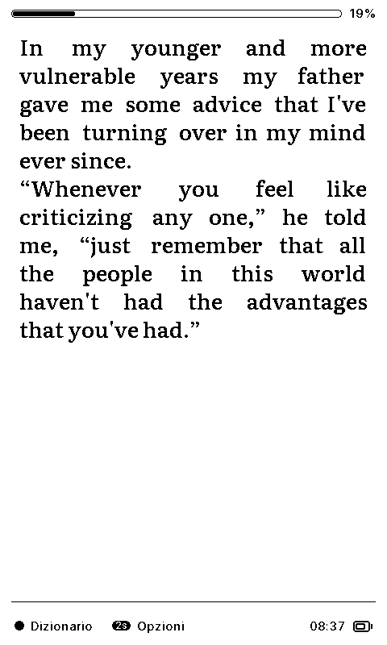

Up and Down turn the page. An EPUB opens on its cover, when it has one; Down goes on to the text. The bar at the top shows the progress through the book.

- **Dizionario** (Dictionary): press SELECT on a page to choose a word and look it up in the dictionary pack installed under `RUSTMIX/APPS/DICT` (see [`SD_CARD_SETUP.md`](SD_CARD_SETUP.md)).
- **Opzioni** (Options): hold SELECT for the table of contents, the book's bookmarks, add or remove a bookmark on this page, and the reading preferences.

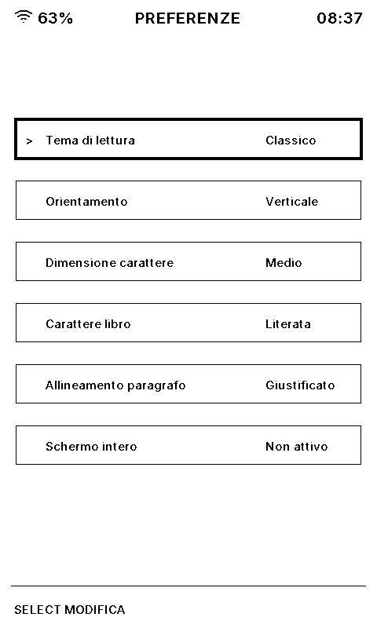

| Preference | Values |
| --- | --- |
| Theme | Normal, High contrast (white on black) |
| Orientation | Portrait, Landscape |
| Font size | Four sizes |
| Font | Literata, Atkinson Hyperlegible (for low vision) |
| Alignment | Left, Justified, Center, Right |
| Full screen | Hide the progress bar and footer |

Every page turn saves the position; each book reopens where you left it, and **Continua** on Home reopens the last one. Photographs of the table of contents and bookmarks (before the merge): [`reader-toc.jpg`](../screenshots/reader-toc.jpg), [`reader-bookmarks.jpg`](../screenshots/reader-bookmarks.jpg), [`reader-bookmarks-list.jpg`](../screenshots/reader-bookmarks-list.jpg).

## 4. Audiobooks

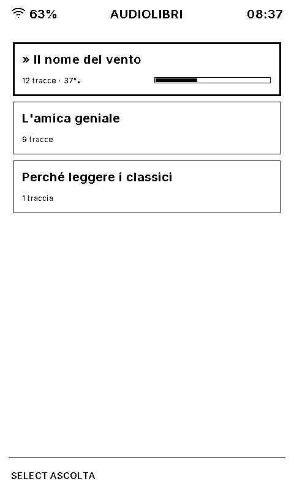

Audiobooks from `RUSTMIX/AUDIO`: a single MP3 file is one audiobook, and a folder of MP3 files is one audiobook whose tracks play in name order, numbers counted as numbers ("2" before "10"). The list shows each title with its progress; SELECT plays the selected one from where it was left.

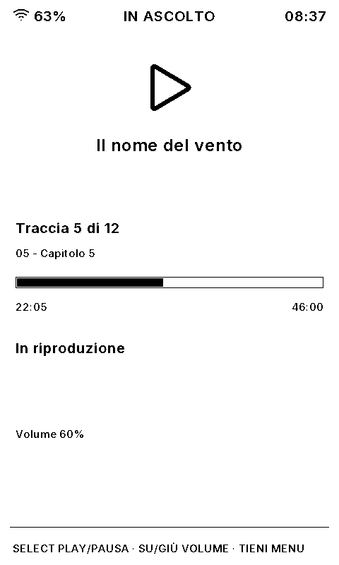

| Control | Player |
| --- | --- |
| SELECT | Play / pause |
| Up / Down | Volume |
| Hold SELECT | Menu: back 30 s, forward 30 s, previous track, next track, stop |
| BOOT | Back to the list; playback goes on |

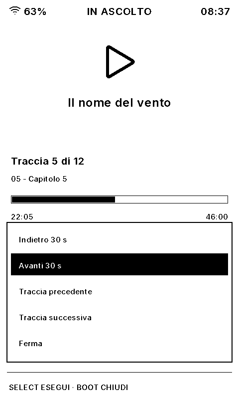

The position of every audiobook is saved in `RUSTMIX/AUDIOPOS.TXT`. Sound comes from the speaker header on the board. MP3 files (MPEG-1 or 2, layer III) play at their own sample rate, mono or stereo.

## 5. Statistics

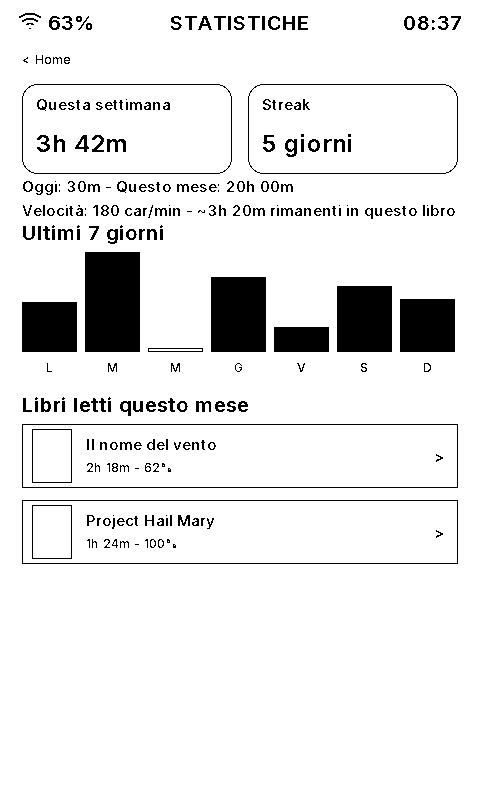

Reading time today, this week and this month, the streak of consecutive days, the reading speed and the last seven days, and the books read most this month. Days follow the time zone set in Settings → Orologio. The time left shown on Home and in the Reader comes from the same reading speed.

## 6. Upload (Wi-Fi transfer)

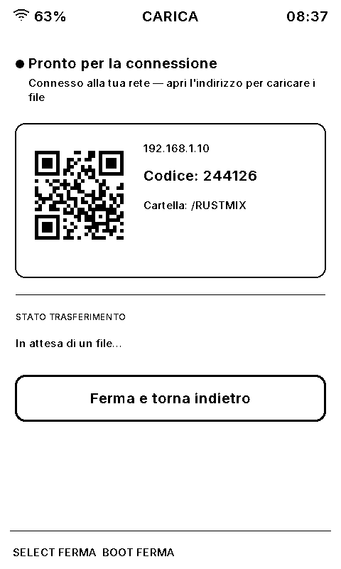

With a Wi-Fi network configured, the screen shows the address to open in a browser on the same network, and the code the page asks for. From there you can upload books and audiobooks, create folders, rename and delete files. Configuration files (`WIFI.TXT`, `CLOCK.TXT`, `DISPLAY.TXT` and the like) are protected.

Without a Wi-Fi network, the device opens its own hotspot and shows a QR code: join it with a phone, and the setup page opens by itself, to add networks (up to 8) and passwords with the phone's keyboard.

## 7. Files

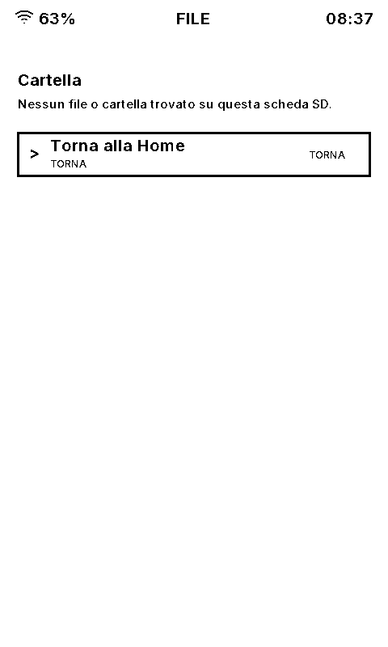

A read-only browser of the whole microSD, with a preview of text files.

## 8. Settings

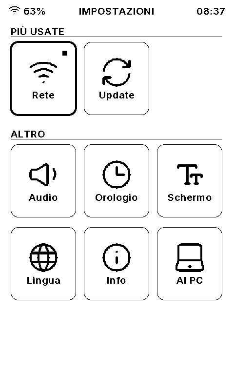

| Tile | Contents |
| --- | --- |
| Rete (Network) | Connection state, saved networks, Wi-Fi setup |
| Update | Check for a firmware update and install it (never checked automatically) |
| Audio | Codec state, volume, test chime |
| Orologio (Clock) | Date, time and time zone (Europe/Rome by default, New York, UTC) |
| Schermo (Display) | Interface text size, sleep screen, automatic standby |
| Lingua (Language) | Italiano, English |
| Info | Firmware version, board and memory state |
| Al PC (To PC) | Connect to PC, see below |

The sleep screen is what stays on the glass during standby: the images in `RUSTMIX/SLEEP` in turn (default) or at random, or the cover of the book being read. Automatic standby comes after 5, 10 (default), 15, 30 or 60 minutes without input, or never.

## 9. Connect to PC

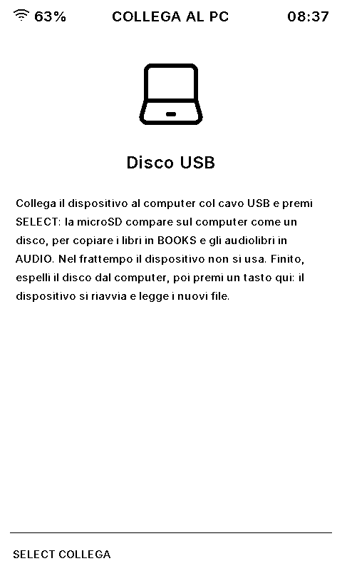

Connect the board to a computer with the USB cable and press SELECT: the microSD appears on the computer as a USB disk, to copy books into `RUSTMIX/BOOKS` and audiobooks into `RUSTMIX/AUDIO`. Meanwhile the device is not usable, and the serial port is gone.

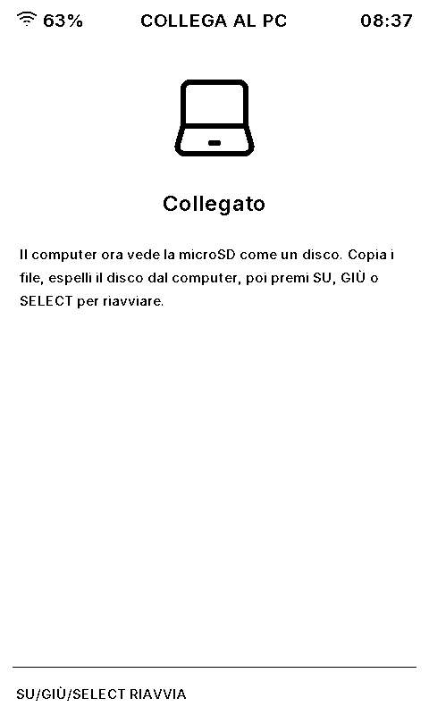

When done, eject the disk on the computer, then press a key on the device (not BOOT): it restarts and finds the new files. The firmware never formats the card, not even when the computer is unplugged without ejecting.

## 10. Standby and power

- **Power, short press**: standby. The sleep screen is drawn and the board powers off; Power turns it back on where you left off.
- **Automatic standby**: see Settings → Schermo.
- **Power, long press**: display maintenance menu, to clear ghosting with a full refresh. The display also runs one by itself every 50 partial refreshes.
- Holding Power for about 6 seconds cuts the power in hardware, like on any device with a PMIC.

## 11. Screenshot index

| Image | Screen |
| --- | --- |
| [rendered-home.png](../screenshots/rendered-home.png) | Home |
| [rendered-library.png](../screenshots/rendered-library.png) | Library |
| [rendered-book-actions.png](../screenshots/rendered-book-actions.png) | Book actions |
| [rendered-reader-page.png](../screenshots/rendered-reader-page.png) | Reader page |
| [rendered-reader-preferences.png](../screenshots/rendered-reader-preferences.png) | Reading preferences |
| [rendered-audiobooks.png](../screenshots/rendered-audiobooks.png) | Audiobooks |
| [rendered-audiobook-player.png](../screenshots/rendered-audiobook-player.png) | Audiobook player |
| [rendered-audiobook-player-menu.png](../screenshots/rendered-audiobook-player-menu.png) | Player menu |
| [rendered-statistics.png](../screenshots/rendered-statistics.png) | Statistics |
| [rendered-wifi-transfer.png](../screenshots/rendered-wifi-transfer.png) | Wi-Fi transfer |
| [rendered-files.png](../screenshots/rendered-files.png) | Files |
| [rendered-settings.png](../screenshots/rendered-settings.png) | Settings |
| [rendered-usb-disk.png](../screenshots/rendered-usb-disk.png) | Connect to PC |
| [rendered-usb-disk-active.png](../screenshots/rendered-usb-disk-active.png) | Connected to PC |
| [continue-reading1.jpg](../screenshots/continue-reading1.jpg) | Continue Reading (photo) |
| [opening_book.jpg](../screenshots/opening_book.jpg) | Opening a book (photo) |
| [epub-reader.jpg](../screenshots/epub-reader.jpg) | EPUB page (photo) |
| [epub-reader-options.jpg](../screenshots/epub-reader-options.jpg) | EPUB page options (photo) |
| [txt-reader.jpg](../screenshots/txt-reader.jpg) | TXT page (photo) |
| [txt-reader-options.jpg](../screenshots/txt-reader-options.jpg) | TXT page options (photo) |
| [reader-toc.jpg](../screenshots/reader-toc.jpg) | Table of contents (photo) |
| [reader-bookmarks.jpg](../screenshots/reader-bookmarks.jpg) | Bookmark added (photo) |
| [reader-bookmarks-list.jpg](../screenshots/reader-bookmarks-list.jpg) | Bookmarks (photo) |
| [reader-reading-prefs.jpg](../screenshots/reader-reading-prefs.jpg) | Reading preferences (photo) |
| [files-listing.jpg](../screenshots/files-listing.jpg) | Files (photo) |
| [directory-listing.jpg](../screenshots/directory-listing.jpg) | Folder in Files (photo) |
| [wifi-transfer.jpg](../screenshots/wifi-transfer.jpg) | Wi-Fi transfer (photo) |
| [network.jpg](../screenshots/network.jpg) | Network (photo) |
| [network-details.jpg](../screenshots/network-details.jpg) | Network details (photo) |
| [audio.jpg](../screenshots/audio.jpg) | Audio (photo) |
| [audio-details.jpg](../screenshots/audio-details.jpg) | Audio details (photo) |
| [clock.jpg](../screenshots/clock.jpg) | Clock (photo) |
| [rtc-details.jpg](../screenshots/rtc-details.jpg) | RTC details (photo) |
| [device-info.jpg](../screenshots/device-info.jpg) | Device info (photo) |
| [device-info1.jpg](../screenshots/device-info1.jpg) | Board info (photo) |
| [device-info2.jpg](../screenshots/device-info2.jpg) | Runtime info (photo) |
| [sleep.jpg](../screenshots/sleep.jpg) | Sleep screen (photo) |
